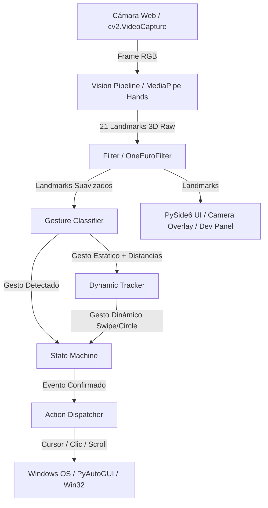

# Análisis de Arquitectura de Referencia (python_gestech)

## 1. Visión General del Proyecto de Referencia
El proyecto python_gestech es una aplicación completa de control por gestos utilizando MediaPipe, OpenCV, PySide6 y PyAutoGUI en Windows. Su propósito es capturar video de la cámara web, detectar landmarks de la mano en tiempo real, clasificar gestos estáticos y dinámicos, y despachar acciones del sistema (movimiento de cursor, clics, desplazamiento, lanzadores radiales, accesos directos).

---

## 2. Mapa de Módulos y Responsabilidades

### A. Núcleo de Visión y Captura (`src/gestech/vision/`)
- `camera.py`: Encapsula `cv2.VideoCapture`. Gestiona hilos de captura asíncrona (`CameraThread`), resolución configurable, FPS objetivo y sincronización de frames.
- `pipeline.py`: Pipeline principal de procesamiento de MediaPipe Hands (`mp.solutions.hands`). Gestiona la inferencia de landmarks, suavizado de puntos de referencia de la mano y detección bimanual.
- `smoothing.py`: Implementa el filtro **One Euro Filter** (`OneEuroFilter`) y promedios móviles para estabilizar las coordenadas de los landmarks y evitar jitter (temblor del cursor).
- `stabilizer.py`: Filtro adicional de estabilización espacial y temporal para gestos continuos.

### B. Clasificación y Reconocimiento de Gestos (`src/gestech/gestures/`)
- `landmarks.py`: Definiciones numéricas de los 21 puntos clave de la mano de MediaPipe (WRIST, THUMB_TIP, INDEX_FINGER_TIP, MIDDLE_FINGER_TIP, RING_FINGER_TIP, PINKY_TIP, etc.) y utilidades geométricas (cálculo de distancias euclidianas, ángulos de articulaciones y vectores).
- `classifier.py`: Clasificador de gestos estáticos (`GestureClassifier`). Evalúa estado de dedos (extendido/doblado), distancias entre puntas de dedos (ej. índice-pulgar para clic) y retorna un estado codificado de gesto (ej. `POINTING`, `PINCH`, `PALM_OPEN`, `PEACE`, `FIST`, `THREE_FINGERS`).
- `dynamic.py`: Reconocimiento de gestos dinámicos basados en trayectorias temporales (`DynamicGestureTracker`). Registra secuencias de coordenadas a lo largo del tiempo para detectar swipes (deslizamiento izquierda/derecha/arriba/abajo) y rotaciones (circling).
- `bimanual.py`: Coordinador de gestos con dos manos (`BimanualTracker`). Detecta interacciones combinadas de ambas manos (ej. zoom con dos manos, rotación de lienzo).

### C. Despacho y Ejecución de Acciones (`src/gestech/actions/`)
- `controls.py` / `actions.py`: Definición de acciones ejecutables (`ActionDispatcher`). Soporta acciones de sistema:
  - Movimiento absoluto y relativo del cursor.
  - Clic izquierdo, clic derecho, doble clic, drag and drop.
  - Scroll vertical y horizontal.
  - Atajos de teclado (teclas de acceso directo del sistema).
  - Control de volumen del sistema.
- `window_switcher.py`: Integración nativa con la API de Windows (`win32gui`, `win32process`) para listar ventanas activas y realizar cambio rápido de aplicaciones mediante gestos.
- `radial_launcher.py`: Menú contextual de selección radial que aparece en pantalla al realizar un gesto específico, permitiendo seleccionar herramientas o accesos directos dibujando en el aire.

### D. Gestión de Estado y Ciclo de Vida (`src/gestech/core/`)
- `state.py`: Máquina de estados finitos (`StateMachine`). Controla los estados de la aplicación (`IDLE`, `TRACKING`, `ACTIVE_CONTROL`, `PAUSED`, `MENU_OPEN`). Evita falsos disparos de acciones requiriendo tiempos de confirmación (*dwell time* o tiempo de permanencia).
- `config.py`: Gestor de configuración global con persistencia en YAML (`settings.yaml`, `gestures.yaml`).
- `logger.py`: Sistema de logging unificado con niveles configurables (DEBUG, INFO, WARNING, ERROR).

### E. Interfaz de Usuario y HUD (`src/gestech/ui/`)
- `main_window.py`: Ventana principal en PySide6 (Qt).
- `camera_view.py`: Canvas de renderizado de video con overlay de landmarks en tiempo real.
- `developer_mode.py`: Panel de depuración para desarrolladores con telemetría en vivo (FPS, latencia de pipeline, distancias de landmarks, gesto actual detectado, log de acciones ejecutadas).
- `minimalist_mode.py`: Modo de pantalla superpuesta limpia / flotante para uso de producción.
- `matrix_rain.py`: Overlay visual estético tipo Matrix Rain activable mediante efectos.

---

## 3. Flujo Completo de Datos

---

## 4. Patrones y Decisiones Clave a Replicar en C++ Qt6 / OpenCV

1. **Decoplamiento de Hilos**:
   - Captura de Cámara (`VisionWorker` en QThread): Corre a 30-60 FPS sin bloquear el hilo de interfaz (GUI Thread).
   - El hilo de visión envía `QImage` y datos de Landmarks mediante Qt Signals & Slots a la GUI.

2. **Estabilización de Cursor (One Euro Filter)**:
   - Mantener parámetros configurables de $f_c$ (frecuencia de corte mínima) y $\beta$ (coeficiente de velocidad) para eliminar temblores de mano preservando rapidez de reacción en movimientos bruscos.

3. **Arquitectura Extensible de Acciones**:
   - `CursorController` abstraerá llamadas de sistema (X11 / Windows / Qt) para mover el ratón de forma fluida.

4. **Interfaz Dual**:
   - `MinimalistModeWidget`: HUD liviano superpuesto.
   - `DeveloperModeWidget`: Panel con gráficos de latencia, monitor de gestos y configuración de umbrales.
