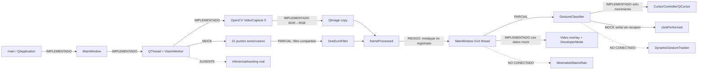

# Arquitectura real baseline

## Runtime y estados de transición

## Threads, señales y slots

| Emisor | Señal/trigger | Receptor | Tipo efectivo | Nota |
|---|---|---|---|---|
| `QThread` | `started` | `VisionWorker::start` | queued al worker | `start` entra en loop y no retorna durante operación normal |
| `VisionWorker` | `frameProcessed(const QImage&, const Landmarks&)` | `MainWindow::onFrameProcessed` | auto→queued entre hilos | `QImage` se copia; `Landmarks` no registrado |
| `VisionWorker` | `errorOccurred(QString)` | lambda con contexto `this` | auto→queued | sólo `qWarning` |
| destructor MainWindow | `invokeMethod("stop")` | `VisionWorker::stop` | blocking queued | no puede despacharse mientras `processLoop` monopoliza event loop |
| `CursorController` | `cursorMoved`, `clickPerformed` | ninguno | — | señales sin consumidores |
| `QTimer` MatrixRain | `timeout` | `onTimerTimeout` | direct mismo hilo | widget nunca se instancia |

## Ownership y lifecycle

- `MainWindow` está en stack de `main`.
- Central widget, labels, Developer widget, CursorController y `QThread` tienen padre Qt y se destruyen con MainWindow.
- `VisionWorker` se crea sin padre (necesario para moverlo), pero no hay conexión `finished→deleteLater`; fuga si se alcanza una salida no bloqueada.
- Destructor intenta stop bloqueante, luego `quit()`/`wait()`. En captura normal, el loop sólo termina si `m_running` cambia; la única escritura solicitada está en el evento que el loop impide procesar. Es un ciclo de espera potencial.
- `VideoCapture` pertenece al worker. No hay acceso normal desde GUI, pero un stop directo futuro haría concurrente el `bool` y release/read.

## Flujo de visión real

1. Cámara index 0, width 640, height 480; no verifica valores negociados.
2. `operator>>` potencialmente bloqueante; sin buffer/FPS configurado.
3. Frame vacío: sleep 10 ms y retry; no error ni dropped counter.
4. BGR→RGB; `QImage` apunta temporalmente a `rgbFrame`, luego `copy()` antes de emitir.
5. En paralelo lógico, pero no inferencia: crea 21 puntos derivados de `t` sintético.
6. El mismo filtro procesa secuencialmente cada eje/punto.
7. Sleep fijo 33 ms adicional; target nominal ≈30 FPS, throughput real inferior/variable.

## Flujos de gesto, acción y GUI

En GUI thread, cada señal clasifica inmediatamente. PINCH tiene prioridad; después se comparan tips/PIP por Y. POINTING o PINCH mueve `QCursor`; PINCH emite “click” cada frame. No hay dispatcher, backend nativo, estado temporal ni gestos dinámicos. Luego se pasa FPS fijo y se agrega una línea de log, se copia frame otra vez, se pintan círculos y se crea `QPixmap`.

## Capacidades ausentes

Detector de palma, ROI, inferencia, tracking temporal/identidad, segunda mano, handedness, confidence, timestamps reales, métricas de latencia/drops, state machine, acciones completas, selección de monitor, escritorio virtual, DPI/HiDPI y persistencia.
