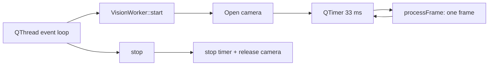

# Phase 1 — Fundación técnica, tests y lifecycle

## 1. Objetivo

Separar los tests core del build de escritorio, registrar la suite existente y hacer que el worker de visión coopere con el event loop de Qt, sin alterar visión, filtrado, gestos ni acciones.

## 2. Baseline recibido

- Rama de entrada: `work`.
- Head de Fase 0: `b3f888ede9720e717ee27ef33ce656233188dbc3`.
- Código original auditado: `554c3afffaa7d2a1287bd675afb56daa40d0d086`.
- La diferencia inicial respecto del código original eran exclusivamente los ocho reportes de Fase 0.

## 3. Arquitectura antes/después

Antes, `VisionWorker::start()` entraba en un `while`, impidiendo al event loop entregar `stop()`. Ahora cada timeout procesa como máximo un frame y retorna.

## 4. CMake

`BUILD_APP` permanece ON por defecto. Qt6/OpenCV y el executable sólo se configuran dentro de ese bloque. `include(CTest)` aporta `BUILD_TESTING`; cuando está activo se crean y registran los cinco executables existentes. Así, `BUILD_APP=OFF` configura el core sin Qt/OpenCV.

## 5. Makefile

La aplicación conserva `build/`; los tests usan `build-tests/`. `make test` configura, construye y ejecuta CTest allí. `make clean` elimina ambos directorios.

## 6. Metatype Qt

`src/core/qt/QtMetaTypes.h` declara `Landmarks` con `Q_DECLARE_METATYPE` sin contaminar `Landmarks.h`. `MainWindow::setupWorker()` ejecuta `qRegisterMetaType<Landmarks>("Landmarks")` antes de conectar/iniciar el thread.

## 7–10. Lifecycle, ownership y shutdown

El worker posee como hijo un `QTimer`; al mover el worker, ambos adquieren affinity del thread. `start()` es idempotente mientras el timer está activo. `stop()` es idempotente, detiene scheduling y libera la cámara. MainWindow invoca `stop` de forma bloqueante, luego `quit` y `wait`. `QThread::finished` se conecta a `VisionWorker::deleteLater`, evitando delete manual cross-thread. Se eliminó `m_running`: estado y timer quedan confinados al worker thread.

## 11. Comportamiento preservado

Cámara 0, petición 640×480, BGR→RGB, copia de QImage, periodo nominal de 33 ms, landmarks mock, tiempo mock incremental, OneEuroFilter existente, clasificación y GUI permanecen conceptualmente iguales.

## 12. Expresamente no implementado

MediaPipe/ONNX/landmarks reales, cambios matemáticos del filtro, rediseño del clasificador, state machine, gestos dinámicos runtime, input real, configuración persistente y telemetría real.

## 13. Limitaciones restantes

Una lectura individual de OpenCV todavía puede retrasar el event loop. El build de aplicación no pudo configurarse sin Qt6/OpenCV, por lo que lifecycle/shutdown fue revisado estáticamente, no ejecutado. `FrameSynchronizer` compila, pero sigue desconectado.

## 14. Criterios de salida

Los cinco tests se descubren y pasan por CTest y Makefile sin Qt/OpenCV; el header FrameSynchronizer es autocontenido; metatype, scheduling event-driven y cleanup están implementados. La aplicación queda environment-blocked y el runtime se clasifica `REVIEWED ONLY`.
