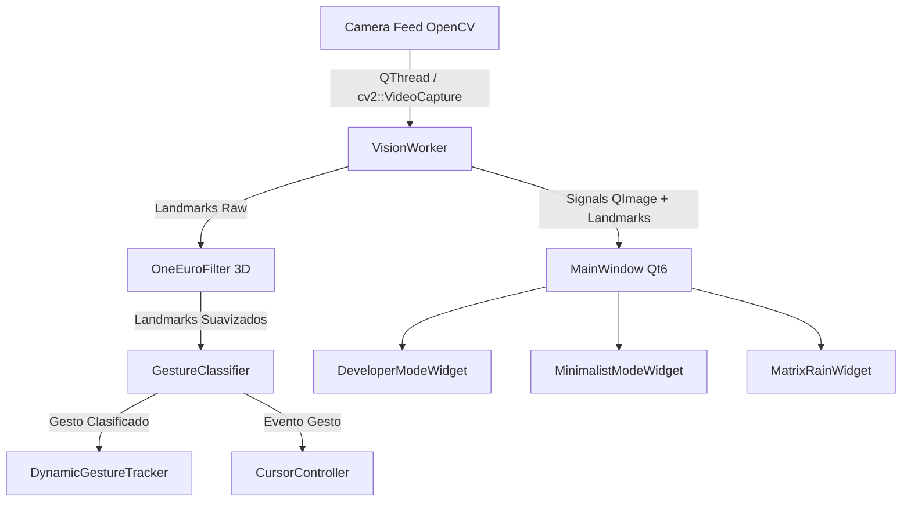

# Informe de Arquitectura: C++ Qt6 vs Python

## 1. Motivación y Objetivos de la Migración

La versión original en Python (`python_gestech`) demostró la viabilidad del pipeline de control por gestos. Sin embargo, la migración a **C++20 nativo con Qt6 y OpenCV** persigue los siguientes objetivos clave:

1. **Baja Latencia e Inferencia en Tiempo Real**: Reducir el tiempo de renderizado y procesamiento por frame a menos de 5 ms.
2. **Uso de Memoria y Overhead de GIL**: Eliminar las limitaciones del GIL (Global Interpreter Lock) de Python para lograr multitarea real en hilos dedicados de captura, visión y GUI.
3. **Despliegue Nativo en Linux/Windows**: Generar un binario nativo sin dependencias de entornos virtuales Python pesados.

---

## 2. Diagrama de Componentes C++

---

## 3. Comparativa de Componentes Clave

| Componente | Implementación Python | Implementación C++ Qt6 | Mejora |
| :--- | :--- | :--- | :--- |
| **Captura de Cámara** | `CameraThread` en `QThread` | `VisionWorker` en `QThread` con `cv::VideoCapture` | Menor latencia de búfer de captura |
| **Filtrado de Temblor** | `OneEuroFilter` en Python | `OneEuroFilter.h` C++20 | Sin sobrecoste de objetos Python por frame |
| **GUI & Overlays** | PySide6 Widgets | Qt6 C++ Widgets Nativos | Renderizado directo en GPU/QPainter |
| **Gestión de Memoria** | Replicación de Arrays NumPy | `std::vector`, `std::array`, referencias `const&` | Cero asignaciones dinámicas por frame |
